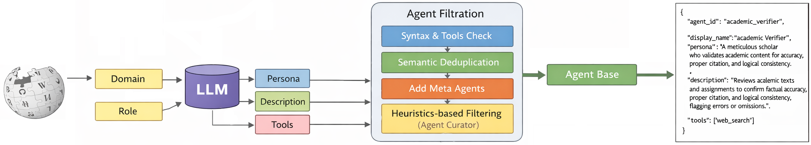

# LLM Agent Factory

**Generate, retrieve, and evaluate structured AI agents with semantic search and RAG.**

[](https://github.com/frontier-ai-next/LLM-Agent-Factory/actions/workflows/ci.yml)
[](https://github.com/frontier-ai-next/LLM-Agent-Factory/tags)
[](https://www.python.org/)
[](LICENSE)
[](https://huggingface.co/frontier-ai/llm-agent-factory)

[Hugging Face artifacts](https://huggingface.co/frontier-ai/llm-agent-factory) · [Data guide](DATASETS.md) · [Extended quick start](QUICK_START.md) · [gMAS](https://github.com/frontier-ai-next/gMAS)



LLM Agent Factory turns a natural-language request into a reusable agent specification. It can search an existing agent library, retrieve the closest examples, and ask an OpenAI-compatible LLM to generate one or more adapted agents.

Each agent includes a stable identifier, display name, persona, description, role, domain, and tool set.

> **Repository split:** GitHub contains the source code, tests, configurations, and documentation. The large agent datasets, training outputs, and model artifacts remain on Hugging Face and are downloaded only when needed.

## Benchmark results

Reported accuracy and efficiency across three evaluation suites. Higher **Acc** is better; lower **TotalTok** and **TotT** are better. Token totals are shown in millions.

### MMLU (N=2,070)

| Family | Method | Acc (%) | TotalTok (M) | TotT (s) |
| --- | --- | ---: | ---: | ---: |
| Baselines | Non-agent | 81.9 | 0.7 | 2.09 |
| Baselines | Qwen3-4B zero-shot | 81.2 | 2.3 | 2.04 |
| Baselines | AutoGen | 80.9 | 2.4 | 6.55 |
| ALR, single-agent | **ALR** | **82.3** | 0.8 | 1.62 |
| ALR, single-agent | ALR-Distill (fine-tuned Qwen3-4B) | 82.0 | 1.6 | 1.77 |
| ALR, multi-agent | **ALR Top-K** | **82.3** | 2.3 | 5.01 |
| ALR, multi-agent | **ALR + Qwen3-4B zero-shot** | **82.3** | 2.6 | 2.84 |
| ALR, multi-agent | **ALR + ALR-Distill** | **82.3** | 1.8 | 2.15 |

### BIG-bench (N=39,185)

| Family | Method | Acc (%) | TotalTok (M) | TotT (s) |
| --- | --- | ---: | ---: | ---: |
| Baselines | Non-agent | 84.7 | 16.7 | 2.60 |
| Baselines | Qwen3-4B zero-shot | 84.3 | 48.3 | 2.68 |
| Baselines | AutoGen | 83.4 | 47.0 | 5.25 |
| ALR, single-agent | ALR | 85.6 | 17.2 | 2.10 |
| ALR, single-agent | **ALR-Distill (fine-tuned Qwen3-4B)** | **85.7** | 33.4 | 2.47 |
| ALR, multi-agent | ALR Top-K | 84.4 | 44.8 | 4.55 |
| ALR, multi-agent | ALR + Qwen3-4B zero-shot | 84.9 | 51.7 | 3.15 |
| ALR, multi-agent | ALR + ALR-Distill | 85.1 | 37.1 | 3.02 |

### BBH (N=2,437)

| Family | Method | Acc (%) | TotalTok (M) | TotT (s) |
| --- | --- | ---: | ---: | ---: |
| Baselines | Non-agent | 68.5 | 1.0 | 2.94 |
| Baselines | Qwen3-4B zero-shot | 68.4 | 2.8 | 2.76 |
| Baselines | AutoGen | 64.9 | 2.9 | 6.49 |
| ALR, single-agent | ALR | 68.5 | 1.0 | 2.10 |
| ALR, single-agent | ALR-Distill (fine-tuned Qwen3-4B) | 69.3 | 2.0 | 2.59 |
| ALR, multi-agent | ALR Top-K | 69.1 | 2.8 | 8.42 |
| ALR, multi-agent | ALR + Qwen3-4B zero-shot | 69.5 | 3.1 | 2.96 |
| ALR, multi-agent | **ALR + ALR-Distill** | **69.6** | 2.2 | 3.15 |

## Core capabilities

| Area | What it provides |
| --- | --- |
| Retrieval | Semantic agent search with BGE, MiniLM, MPNet, E5, or a TF-IDF fallback |
| Reranking | Optional cross-encoder reranking for higher-quality results |
| Generation | RAG-based agent creation through OpenAI-compatible endpoints |
| Agent tooling | Scripts for generation, curation, deduplication, task creation, and SFT preparation |
| Evaluation | Reproducible experiment runner, checkpoints, metrics, and benchmark scenarios |
| Multi-agent runtime | The official [gMAS](https://github.com/frontier-ai-next/gMAS) repository, pinned as a Git submodule |

## Install

LLM Agent Factory requires Python 3.12 or 3.13.

```bash
git clone --recurse-submodules https://github.com/frontier-ai-next/LLM-Agent-Factory.git
cd LLM-Agent-Factory
python -m pip install -e ./gmas-main -e ".[rag]"
```

If the repository was cloned without submodules, initialize gMAS before installing:

```bash
git submodule update --init --recursive
```

Copy the environment template when generation through an LLM is required:

```bash
cp env.example .env
```

```dotenv
LLM_API_KEY=your-api-key
LLM_BASE_URL=https://api.openai.com/v1
LLM_MODEL=gpt-4
```

## Download the agent dataset

The default retriever expects `task-agents_database/agents_eng.jsonl`. Download it directly from the canonical Hugging Face release:

```bash
python -m pip install -U huggingface_hub
hf download frontier-ai/llm-agent-factory task-agents_database/agents_eng.jsonl --local-dir .
```

The directory is intentionally ignored by Git. See [DATASETS.md](DATASETS.md) for the complete artifact inventory, sizes, optional downloads, and provenance.

## Quick start

Search the existing agent library:

```bash
agent-search -q "Python code review specialist" -k 5
```

Generate a new agent with retrieval-augmented context:

```bash
agent-generate "Create an agent that reviews Python APIs for security issues"
```

Generate several variants:

```bash
agent-generate --agents 3 --format pretty "Customer support specialist"
```

Programmatic usage:

```python
from retrieval import quick_generate, quick_search

results = quick_search("machine learning research assistant", top_k=3)
for result in results:
    print(result.agent.display_name, result.score)

agents = quick_generate(
    "A Python code-review assistant",
    api_key="your-api-key",
)
print(agents[0]["display_name"])
```

## How it works

1. The loader reads the downloaded agent records.
2. An embedding model builds or restores a local semantic index.
3. Retrieval selects the closest agent examples and can rerank them.
4. The RAG layer combines those examples with the request.
5. The configured LLM returns a validated, structured agent specification.

The task-agent dataset keeps every question/agent pair. For retrieval, the first run builds one embedding per unique
agent, shows live progress, and stores the completed index in `retrieval/.cache/`; later runs reuse that cache.

## Repository layout

```text
LLM-Agent-Factory/
├── config/          # Small role, domain, and tool vocabularies
├── experiments/     # Evaluation runner, metrics, and checkpoints
├── gmas-main/       # Official gMAS Git submodule used by experiments
├── retrieval/       # Search, embeddings, reranking, RAG, CLI, and tests
├── script/          # Dataset generation, curation, deduplication, and training scripts
├── DATASETS.md      # External artifact manifest and download commands
├── examples.py      # Programmatic examples
└── pyproject.toml   # Package metadata and dependencies
```

## Development

```bash
python -m pip install -e ".[dev]"
pytest retrieval/tests -v
```

The submodule is pinned to a reviewed gMAS commit. To update it intentionally:

```bash
git submodule update --remote --merge gmas-main
```

Changes to the multi-agent runtime belong in the upstream
[frontier-ai-next/gMAS](https://github.com/frontier-ai-next/gMAS) repository;
this project only contains its integration layer.

Large or generated artifacts must stay outside Git history. CI checks this boundary on every push and pull request.

## Release provenance

This source release was migrated from Hugging Face revision [`505aa098`](https://huggingface.co/frontier-ai/llm-agent-factory/commit/505aa09857889bc679f2b914e2c33527051c37a8). The canonical heavy artifacts remain attached to that Hugging Face repository.

The source code in this repository is released under the [MIT License](LICENSE). Datasets, model weights, and other heavy artifacts remain on Hugging Face and are governed by the metadata published with those artifacts.
